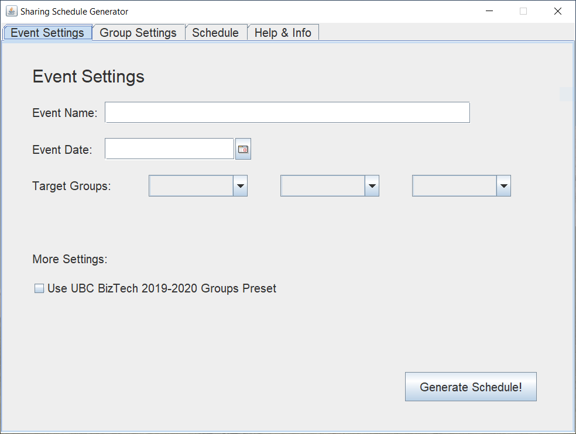
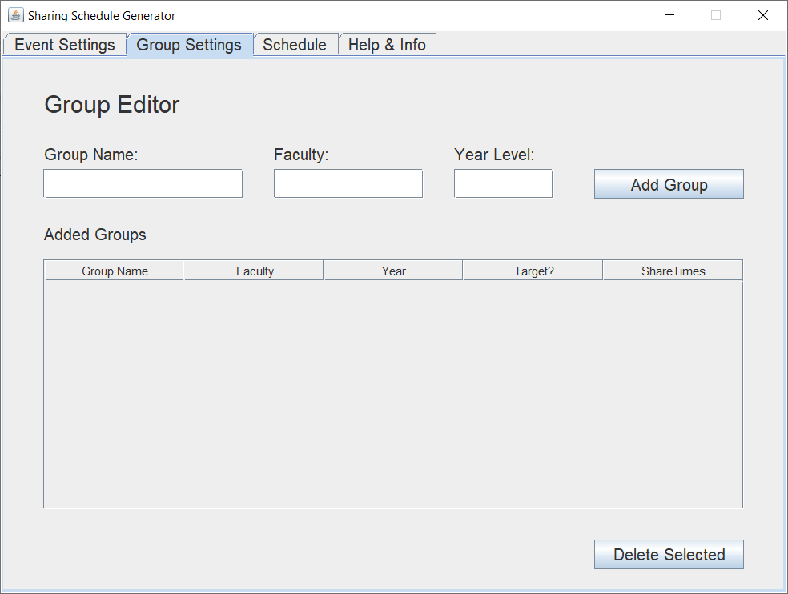
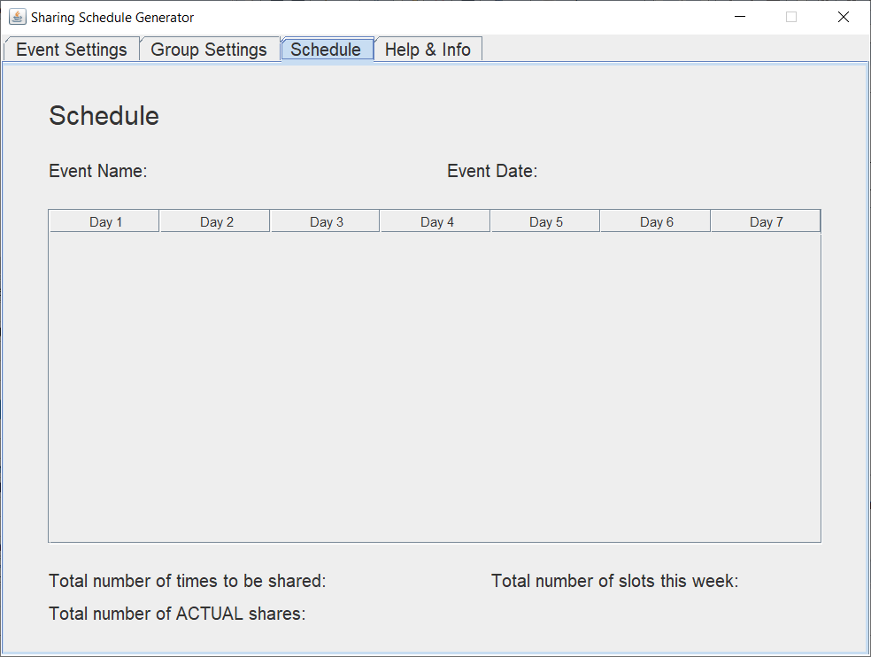

# Sharing Shedule Generator
A marketing tool designed to help you effectively share your event with different groups. 
Built using Java.

  

## :star: Introduction 
Thank you for downloading and using this sharing schedule generator!

This program is designed to be used as a marketing tool for advertising events on Facebook. One of the ways to maximize the exposure of your event is to share it across different Facebook groups. However, if you share your event too often within the same group, its group members may get annoyed and form a negative impression on your event. The goal of this program is 
to automatically create a sharing schedule, so you can avoid oversharing and worrying about when to share your event and with which group. Even though this program was originally designed for advertising through Facebook, it can also be used for different platforms as long as the same logic applies (advertising your event to different groups of people). 

## :pushpin: Features 
* Automatically generates a 7-day marketing schedule detailing which groups you should share your event with on which day.
    - Currently the program has a standard 7 days of marketing (prior to the event day). This time length is what we have found to be the most effective for our BizTech events.

* Customizable groups, allowing you add and delete your own groups.

* Built-in marketing strategies such as:
    - Sufficient day gaps between sharing your event with the same group in order to avoid spamming and annoying group members.
    - Customizable target groups, allowing you to maximize your event exposure with the people that you want your event to attract the most.
    - More shares on days with more active users. 

* User-friendly interface and display.

## :question: How-To-Use
To use this program, simply download the `Sharing Schedule Generator.jar` or `SharingScheduleGenerator.exe`. Your computer may tell you that the file is dangerous but trust me it's not (I swear I'm not trying to hack your computer), I just haven't found a way to certify or sign my program to make it accepted by windows security yet. 

Most of the functions of this generator are quite self-explanatory, but if you are stuck or confused, here is a quick 3 step guideline on how to create your first sharing schedule!

**Step 1:** Create at least 3 groups under “Group Settings” OR directly enable one of the built-in presets* under “Event Settings”.

**Step 2:** Pick an event name, date, and 3 target groups under “Event Settings”. Target groups are groups that your event will be shared with the most (higher frequency). 

**Step 3:** Click “Generate Schedule” under “Event Settings” and voila! Your generated schedule can be viewed under “Schedule”.

## :bulb: Origins 
During my time as one of the marketing directors for UBC BizTech (the largest technology club at the University of British Columbia), one of our main event marketing strategies is to share our events to different Facebook groups. In order to make sure our events receive enough exposure without spamming and annoying its members, we usually create a sharing schedule, detailing which Facebook groups we will share our events to on which day. 

However, the creation of these schedules is a very tedious and boring task. After having to go through such a dull process myself, I noticed that a lot of the steps involved could be automated. Instead of building these schedules myself, I decided that I was going to build a program that generates these schedules automatically, with a built in marketing algorithm and all. And voila! The sharing schedule generator was born.

Without sacrificing the marketing strategies embedded inside these schedules (such as selecting different target groups, and sharing more on days where our Facebook users are most active), I was able to build a program that automatically generates a sharing schedule given a list of groups and an event date. 

Although the current program is very tailored towards UBC BizTech, I believe that other clubs or organizations are still be able to benefit from its use. The group settings feature allows custom groups to be added, and with just a few clicks, a sharing schedule is generated and you are ready to start sharing!

Additionally, there are several new features that I want to add in the future in order to enhance this program’s customizability and accessibility, so stay tuned!

## :wave: More Questions?
If you have any further questions or found any bugs to report, please feel free to contact me [here!](http://scheng.ca/#contact)
